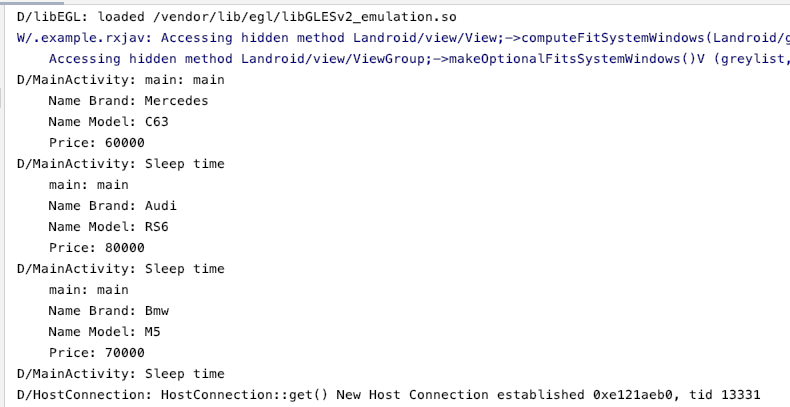

# What is RxJava?
Reactive Extension is a powerful library for asynchronous operations built on Java, that is, observable pattern. You can create asynchronous data stream on any thread, transform the data and consumed it by an Observer on any thread. The library offers wide range of amazing operators like map, combine, merge, filter and lot more that can be applied onto data stream.

## Basic concepts

Observable: The class that will do the spreading action of the data.

Observer: It listens to the data in the spreading state and does the inclusion process.

Subscribe: Establishes the connection between Observable and observer.

Schedulers.io(): disk/file reading, database CPU does the work that won't be too busy.<dt>

AndroidSchedulers.mainThread(): This provides access to android Main Thread / UI Thread. Usually operations like updating UI, user interactions happens on this thread. We shouldn’t perform any intensive operations on this thread as it makes the app glitchy or ANR dialog can be thrown.<dt>

## Output of my project<dt>

